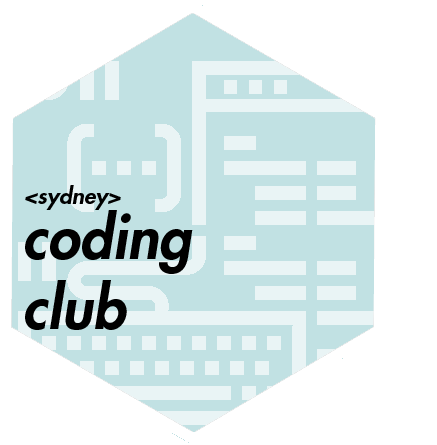
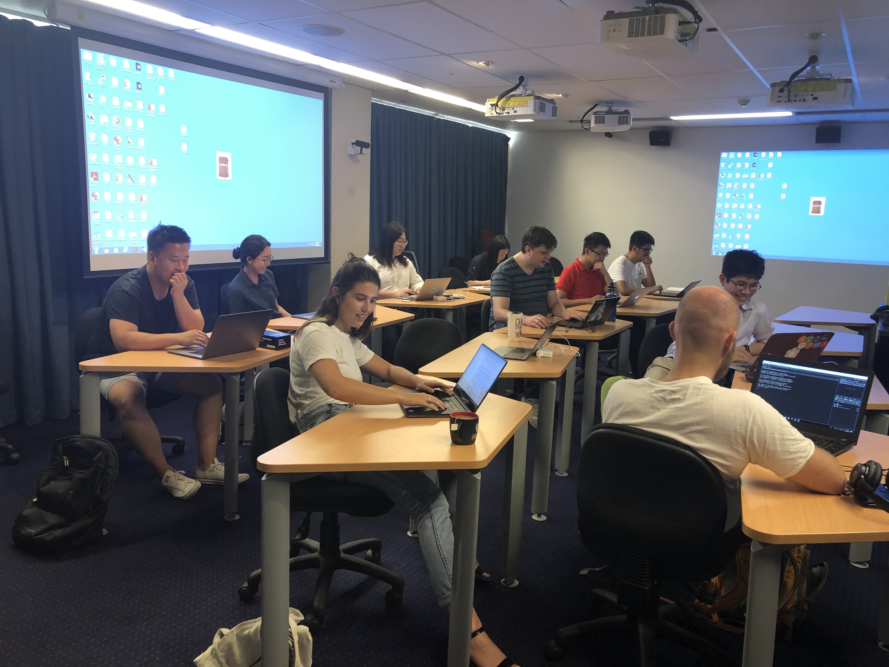

# The Sydney Coding Club 

### The Origin
The coding club was motivated by
[ozunconf 2018](http://ozunconf18.ropensci.org). The plan is to adopt a similar
format to ozunconf and let the participants drive the agenda. 

### What Happens
You come to the designated place and work as much or as little on coding project you want. The
idea is to be surrounded by people who wants to code! People are free to sit down and work on their own or work with others on a project. 

### How to initiate a project
The project can be
submitted as an [issue](https://github.com/emitanaka/sydneycodingclub/issues)
on this repository. 

### Showcase
Occassionally we will have 5 minutes showcase of projects
people have worked on. 

### What can be achieved
You can have a look at the list of amazing projects
[here](https://github.com/ropensci/ozunconf18/blob/master/content/projects.md)
a group of about 50 people accomplished in two working days at the ozunconf18.

### Some Plans and Ideas 

- Weekly meeting on 3-5pm Fridays once the semester begins.
- Occasional tutorials, especially for beginners on 2-3pm Fridays. 
- Occasional extended club gatherings on 5-7pm. The aim is to particularly encourage industry coders (especially former usyd students or affiliated) to come. 

Meeting
--------

- The second meeting will take place **Wednesday 3-5pm 16th Jan 2018, Carslaw 829, The University of Sydney**.
- The first meeting occured at **Tuesday 3-5pm 18th Dec 2018, Carslaw 829, The
University of Sydney**.

